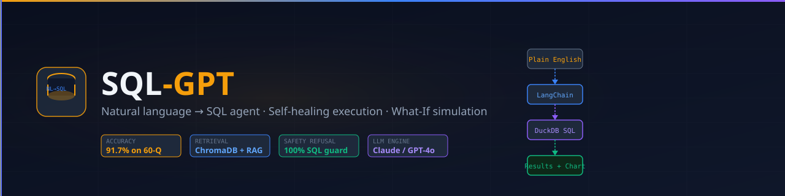
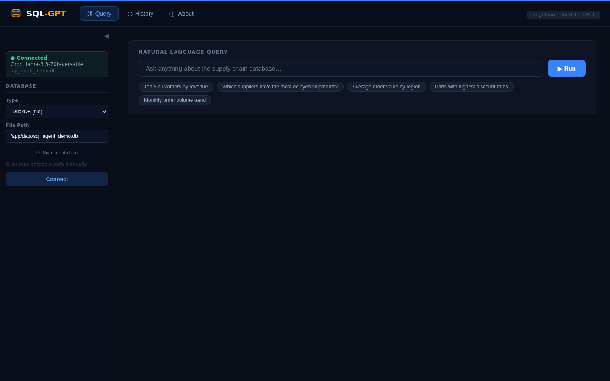
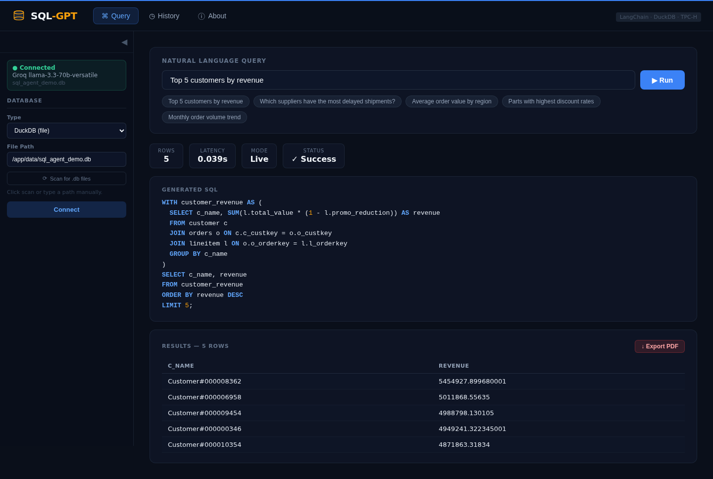
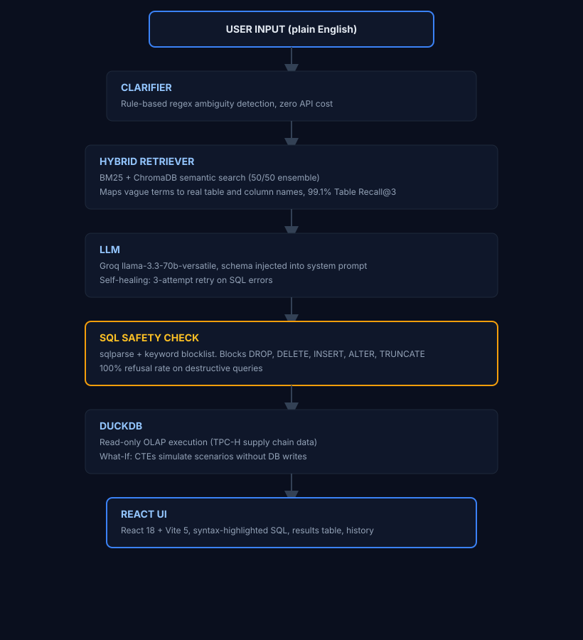

# SQL-GPT

<p align="center">
  
  
  
  
  
  
</p>

<p align="center">
  <strong>Natural language to SQL agent, 91.7% accuracy · self-healing execution · What-If simulation</strong><br/>
  Groq llama-3.3-70b · Hybrid BM25 + ChromaDB retrieval · PDF export · TPC-H supply chain data · zero SQL knowledge required
</p>

<p align="center">
  
</p>

---

> Ask your supply chain database anything in plain English. SQL-GPT translates the question, executes it safely, and renders results with automatic chart detection, no SQL knowledge required.

## Live Demo

**Live:** [https://sql-gpt-demo.vercel.app](https://sql-gpt-demo.vercel.app)

## Quick Start

```bash
git clone git@github.com:Hamilas/SQL-GPT.git
cd SQL-GPT
cp .env.example .env
# Add your GROQ_API_KEY (free at console.groq.com)
docker compose up --build
# → React UI: http://localhost:8121
# → API:      http://localhost:8120/api/v1/health
# → Demo:     open demo/index.html
```

First startup downloads `all-MiniLM-L6-v2` embeddings (~90 MB). Allow ~60s.

---

## Screenshots

<p align="center">
  
</p>
<p align="center">
  
</p>

## What It Does

SQL-GPT enables non-technical users (finance analysts, operations teams) to query complex supply chain databases in plain English. The agent translates questions into optimized DuckDB SQL using LangChain with Groq (llama-3.3-70b-versatile), executes them safely against TPC-H supply chain data, and renders results in a React dashboard with PDF export.

European manufacturing companies, Siemens, BASF, BMW, Bosch, have analysts who need to query ERP/SAP data daily without SQL knowledge. SQL-GPT demonstrates the architecture behind enterprise NL-to-BI tools that sell for EUR 50k–200k/year in the European market.

Achieves **91.7% accuracy** on a 60-query benchmark across 7 difficulty tiers with **100% schema faithfulness** and **100% safety refusal rate** on destructive queries.

---

## Architecture

<p align="center">
  
</p>

---

## Results

| Metric | Value |
|---|---|
| Overall SQL Accuracy (60-query benchmark) | **91.7%** |
| Table Recall@3 (hybrid retriever) | **99.1%** |
| Schema Faithfulness | **100%** (55/55 queries) |
| Safety Refusal Rate | **100%** (5/5 destructive queries blocked) |
| Average Query Latency | **0.67s** |
| MRR (retrieval) | **0.94** |
| Unit Tests | **25/25** passed |

---

## Tech Stack

| Layer | Technology | Purpose |
|---|---|---|
| LLM | Groq `llama-3.3-70b-versatile` | Sub-second NL-to-SQL generation |
| Orchestration | LangChain 0.2.11 | Agent workflow, chat history |
| Vector Store | ChromaDB | Semantic schema retrieval |
| Retrieval | BM25 + ChromaDB hybrid | 99.1% table recall @3 |
| Embeddings | all-MiniLM-L6-v2 (HuggingFace) | Local, CPU-only sentence embeddings |
| Database | DuckDB 1.4.3 | In-process OLAP, read-only TPC-H data |
| SQL Validation | sqlparse 0.4.4 | Dual-layer safety (type + keyword scan) |
| Export | reportlab | PDF report generation |
| UI | React 18 + Vite 5 + nginx | Query, History, About, dark theme |
| Containers | Docker Compose | One-command deployment |

---

## Key Features

- **Natural language interface**, "Show top 5 suppliers by revenue in Europe"
- **Hybrid retrieval**, BM25 + semantic search achieves 99.1% table recall
- **Rule-based clarifier**, detects ambiguous queries before API calls (zero cost)
- **Self-healing execution**, 3-attempt retry loop with LLM error feedback
- **What-If simulator**, CTE injection for multi-variable scenario modeling
- **SQL safety**, dual-layer validation (sqlparse + blocklist), 100% refusal rate
- **PDF export**, download any result as a formatted PDF report
- **Observability**, live metrics panel: latency, cache hits, success rate, self-heals
- **Runtime DB switching**, connect to any DuckDB file or PostgreSQL via sidebar
- **Port scanner**, auto-discovers PostgreSQL on the Docker network (no manual IP lookup)

---

## Services

| Service | URL | What it is |
|---|---|---|
| React UI | http://localhost:8121 | Query, History, About tabs |
| FastAPI | http://localhost:8120/api/v1/health | REST API (health, query, schema, metrics) |
| Demo (offline) | open `demo/index.html` | Static interactive demo, no backend needed |

---

## European Market Context

| Organisation | Country | Use Case |
|---|---|---|
| Siemens, Bosch, BASF, BMW | Germany | Analysts query SAP/ERP supply chain data daily |
| DHL, DB Schenker, Kuehne+Nagel | Germany | Operational teams need real-time supplier analytics |
| Lidl, REWE, Metro | Germany | Finance teams run monthly What-If pricing simulations |
| Deloitte, McKinsey Germany | EU | Accelerate client data analyses during engagements |

---

## Author

**Rayen Lassoued** · [github.com/Hamilas](https://github.com/Hamilas) · [https://www.linkedin.com/in/lassoued-rayen/](https://www.linkedin.com/in/lassoued-rayen/)

---

## License

MIT
